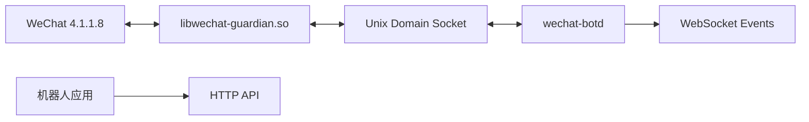

# WeChat 机器人框架实施计划

## 1. 目标

在现有 Linux 微信运行时 Hook 基础上，提供一个仅本机访问的机器人接口：

- 通过 HTTP 发送文本消息；
- 通过 WebSocket 监听收到的文本消息和发送结果；
- 保留现有防撤回与自动原图功能；
- 微信升级或某个机器人 Hook 失效时安全降级，不阻止微信启动；
- 为图片、文件、引用、`@成员` 等后续能力保留清晰扩展边界。

第一交付点：`POST /v1/messages/text` 能向 `filehelper` 发送文本，`GET /v1/events` 能收到私聊/群聊文本及发送结果。

## 2. 第一版范围

### 包含

- 接收私聊文本；
- 接收群聊文本，并区分群会话和实际发送者；
- 发送私聊、群聊文本；
- HTTP 健康检查和文本发送接口；
- WebSocket 消息事件、发送结果和运行状态事件；
- Bearer Token 鉴权、发送限速、请求幂等；
- 单微信进程、单账号；
- 当前已适配的微信 `4.1.1.8` 和 Build ID。

### 暂不包含

- 图片、视频和文件发送；
- `@成员`、引用、转发和撤回；
- 通过昵称查找收件人；
- 好友、群和成员管理；
- 多微信进程或多账号路由；
- 公网监听。

这些能力不能复用未经验证的“通用消息构造器”。文本链路稳定后，应按消息类型逐一逆向、验证和开放。

## 3. 总体架构



不把 HTTP、JSON 或 WebSocket 服务直接放进微信进程。微信内 Runtime 必须保持薄、小、非阻塞；协议解析、鉴权、事件存储和慢客户端处理全部放到独立守护进程。

### 3.1 微信内 Runtime

`libwechat-guardian.so` 负责：

- Hook 收消息的稳定边界；
- 在对象生命周期内复制必要字段；
- 将消息事件放入有界队列；
- 接收发送命令；
- 在微信要求的线程上调用发送函数；
- 捕获并关联异步发送结果；
- 汇总 capabilities 和原子计数器。

Hook 回调内禁止：HTTP/WS、阻塞 I/O、磁盘写入、JSON 序列化、等待争用锁，以及把微信对象指针交给异步线程。

### 3.2 本地 IPC

Unix Socket：

```text
/run/user/$UID/wechat-guardian/bot.sock
```

帧格式：

```text
uint32 payload_length
uint16 protocol_version
uint16 message_kind
uint64 correlation_id
payload
```

首批消息类型：

- `runtime.hello`
- `runtime.health`
- `runtime.capabilities`
- `message.received`
- `message.send`
- `message.send.accepted`
- `message.send.result`
- `runtime.gap`

IPC 断开不得影响微信。接收事件进入固定容量队列；队列满时丢弃事件并增加 `dropped_events`，不能阻塞微信线程。恢复连接后上报丢失数量。

### 3.3 `wechat-botd`

独立用户级守护进程负责：

- Unix Socket 通信；
- HTTP 和 WebSocket 服务；
- 鉴权、限流与参数校验；
- 请求 ID、幂等控制和状态机；
- 有上限的事件持久化与短期重放；
- Runtime 二进制协议与外部 JSON 协议转换。

建议使用 C++20 和 Boost.Asio/Beast，延续现有 CMake 原生构建和单一发布链。

## 4. HTTP API

默认仅监听 `127.0.0.1:19787`。

### 4.1 健康检查

```http
GET /v1/health
Authorization: Bearer <token>
```

```json
{
  "status": "ready",
  "wechat": {
    "connected": true,
    "pid": 12345,
    "version": "4.1.1.8",
    "build_id": "be2d6b53c50f5cf754b00a8001e5ee88980fdeeb"
  },
  "capabilities": ["message.receive.text", "message.send.text"],
  "queue": {"pending_commands": 0, "dropped_events": 0}
}
```

### 4.2 发送文本

```http
POST /v1/messages/text
Authorization: Bearer <token>
Content-Type: application/json
```

```json
{
  "conversation_id": "wxid_example",
  "text": "测试消息",
  "client_request_id": "7ef9280e-4a7c-40c9-9e10-a62b7d0fc01f"
}
```

成功接收命令时返回 `202 Accepted`：

```json
{
  "request_id": "01K4...",
  "client_request_id": "7ef9280e-4a7c-40c9-9e10-a62b7d0fc01f",
  "state": "queued"
}
```

`queued` 仅表示守护进程和 Runtime 接受命令，不表示微信服务器发送成功。

### 4.3 查询请求状态

```http
GET /v1/requests/{request_id}
Authorization: Bearer <token>
```

状态机：

```text
queued -> dispatched -> succeeded
                     \-> failed
```

### 4.4 HTTP 状态码

- `400`：JSON 或字段错误；
- `401`：认证失败；
- `409`：相同 `client_request_id` 对应不同请求内容；
- `413`：请求体或文本过大；
- `429`：发送速率或队列超限；
- `503`：微信未运行、Runtime 未连接或发送能力不可用。

## 5. WebSocket 事件

```http
GET /v1/events?since=1234
Authorization: Bearer <token>
Upgrade: websocket
```

第一版 WebSocket 只输出事件；发送命令统一走 HTTP，避免两套命令语义。

### 5.1 收到文本

```json
{
  "version": 1,
  "seq": 1235,
  "event": "message.received",
  "event_id": "wx:987654321",
  "timestamp_ms": 1788443000123,
  "account_id": "wxid_local",
  "conversation_id": "123456789@chatroom",
  "conversation_type": "group",
  "sender_id": "wxid_sender",
  "message_id": "987654321",
  "message_type": "text",
  "text": "你好"
}
```

### 5.2 发送结果

```json
{
  "version": 1,
  "seq": 1236,
  "event": "message.send_result",
  "request_id": "01K4...",
  "client_request_id": "7ef9280e-4a7c-40c9-9e10-a62b7d0fc01f",
  "conversation_id": "wxid_example",
  "state": "succeeded",
  "message_id": "987654322",
  "timestamp_ms": 1788443000456
}
```

### 5.3 运行状态事件

- `runtime.connected`
- `runtime.disconnected`
- `runtime.capabilities_changed`
- `event.gap`

客户端必须按 `seq` 检测缺口、按 `event_id` 去重；断线重连传入最后处理成功的 `since`。`wechat-botd` 使用有上限的 SQLite WAL 事件日志支持短期重放，不承诺全局 exactly-once。

## 6. 实施阶段

### 阶段 A：收消息入口

定位“消息已经解析完成、对象仍然完整”的稳定函数，先做 observation-only probe。

确认私聊、群聊、自己发送、系统消息和非文本消息的调用行为，以及消息 ID、会话 ID、发送者 ID、类型、时间、正文、线程和对象生命周期。Probe 默认只记录长度与哈希；样本确认后再允许复制正文。新入口必须加入 32 字节机器码校验，并同步加入 `tools/inspect.cpp`。

验收：指定私聊与群聊各发送多条含中文、换行和 emoji 的文本，捕获字段与界面一致且无重复。

### 阶段 B：发送入口

定位微信现有高层文本发送函数，不自行实现微信网络协议。确认参数、libc++ 字符串布局、对象所有权、调用线程、请求入队返回值、异步结果回调，以及私聊和群聊是否共用入口。

IPC 工作线程不能直接调用发送函数。必须找到微信内部任务调度器，或在确认过的发送线程上排空命令队列。

验收：仅向预先指定的测试会话或 `filehelper` 发送；ASCII、中文、emoji、换行均正确；空文本、超长文本和无效 ID 明确失败；相同 `client_request_id` 不重复发送；最终结果能关联 HTTP 请求。

### 阶段 C：IPC 与并发边界

- 实现版本化帧编解码；
- 实现固定容量事件队列和命令队列；
- 实现自动重连、心跳与 capability 协商；
- 验证 Runtime/daemon 任一侧重启不会挂住或崩溃微信；
- 慢消费者只能触发丢弃与 `runtime.gap`，不能形成微信线程背压。

### 阶段 D：HTTP、WS 与事件存储

- 实现健康检查、发送和请求状态接口；
- 实现 Token 鉴权、限流、大小限制和幂等；
- 实现 WebSocket 广播、断线重放与慢客户端隔离；
- 使用 SQLite WAL 保存有上限的请求和事件窗口；
- 使用 fake runtime 完成守护进程集成测试。

### 阶段 E：能力门控与安装

分别安装防撤回、图片、收消息、发消息和发送结果 Hook。某个机器人 Hook 校验失败时，只移除相应 capability；防撤回和自动原图仍可继续。机器人适配失败不能阻止微信启动。

## 7. 代码布局

```text
include/guardian/
  bot_protocol.hpp
  event_queue.hpp
  wechat_string.hpp

src/
  runtime.cpp
  revoke_hook.cpp
  image_hook.cpp
  message_hook.cpp
  send_hook.cpp
  bot_bridge.cpp

daemon/
  main.cpp
  ipc_server.cpp
  http_server.cpp
  event_store.cpp
  auth.cpp

tests/
  test_bot_protocol.cpp
  test_event_queue.cpp
  test_bot_http.cpp
  test_bot_websocket.cpp
  fake_wechat_runtime.cpp
```

`wechat-botd` 不链接或访问微信进程内存。

## 8. 安全边界

- HTTP 默认只绑定 `127.0.0.1`；
- Token 安装时生成并保存到 `~/.config/wechat-guardian/bot.token`，权限 `0600`；
- Unix Socket 目录权限 `0700`，通过 `SO_PEERCRED` 校验 UID；
- Token 不允许放在 URL query 中；
- 日志不记录消息正文或 Bearer Token；
- 限制 HTTP body、文本长度、WS 客户端数和待发送队列；
- 默认限制发送速率并支持 receive-only 模式；
- 不提供公网监听参数。远程访问由用户自行配置 TLS 反向代理和额外认证。

## 9. 管理命令

```bash
sudo wechat-guardian install bot
wechat-guardian bot enable
wechat-guardian bot enable --receive-only
wechat-guardian bot disable
wechat-guardian bot status
wechat-guardian bot token rotate
wechat-guardian bot logs
```

守护进程使用用户级 systemd 服务，不以 root 身份运行：

```text
~/.config/systemd/user/wechat-botd.service
```

## 10. 验证顺序

1. 回归当前防撤回和自动原图；
2. 用 probe 确认收消息入口与字段；
3. 用硬编码测试目标证明微信线程内文本发送；
4. 将发送操作迁移到有界命令队列；
5. 加入 Unix Socket 和 fake runtime 集成测试；
6. 加入 HTTP、认证与幂等测试；
7. 加入 WS、断线重放与慢客户端背压测试；
8. 使用真实微信执行完整闭环；
9. 再次验证远端撤回、自己撤回和自动原图没有回归。

真实微信最终验收：

- HTTP 发给 `filehelper`；
- WS 收到发送结果及本地消息事件；
- 另一账号回复后 WS 收到入站事件；
- 微信重启后 Runtime 自动重连；
- 守护进程重启后可使用 `since` 恢复事件；
- 任一机器人 Hook 校验失败时微信仍正常启动。

## 11. 发布策略

- 第一版标记为实验性，仅支持固定微信 Build ID；
- 每个新增 Hook 均校验入口机器码；
- 微信升级后默认关闭不匹配 capability，不复用旧偏移；
- 协议版本、HTTP API 版本和微信适配版本分别维护；
- 提交中保存逆向证据、字段说明与真实验收记录；
- 先发布文本闭环，再逐项增加富媒体能力。
